# Koding & GitLab

> [Introduced][ce-5909] in GitLab 8.11.

This document will guide you through using Koding integration on GitLab in
detail. For configuring and installing please follow the
[administrator guide](../../administration/integration/koding.md).

You can use Koding integration to run and develop your projects on GitLab. This
will allow you and the users to test your project without leaving the browser.
Koding handles projects as stacks which are basic recipes to define your
environment for your project. With this integration you can automatically
create a proper stack template for your projects. Currently auto-generated
stack templates are designed to work with AWS which requires a valid AWS
credential to be able to use these stacks. You can find more information about
stacks and the other providers that you can use on Koding following the
[Koding documentation][koding-docs].

## Enable Integration

You can enable Koding integration by providing the running Koding instance URL
in Application Settings under **Admin area > Settings** (`/admin/application_settings`).

Once enabled you will see `Koding` link on your sidebar which leads you to
Koding Landing page.

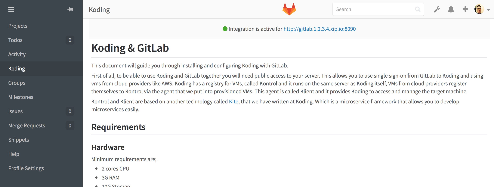

You can navigate to running Koding instance from here. For more information and
details about configuring the integration, please follow the
[administrator guide](../../administration/integration/koding.md).

## Set up Koding on Projects

Once it's enabled, you will see some integration buttons on Project pages,
Merge Requests etc. To get started working on a specific project you first need
to create a `.koding.yml` file under your project root. You can easily do that
by using `Set Up Koding` button which will be visible on every project's
landing page;

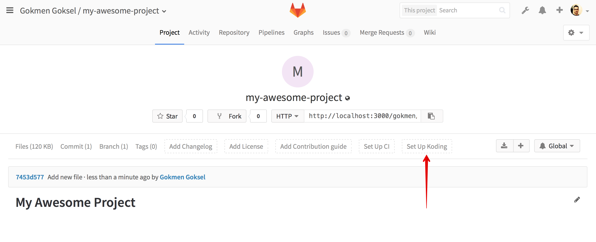

Once you click this will open a New File page on GitLab with auto-generated
`.koding.yml` content based on your server and repository configuration.

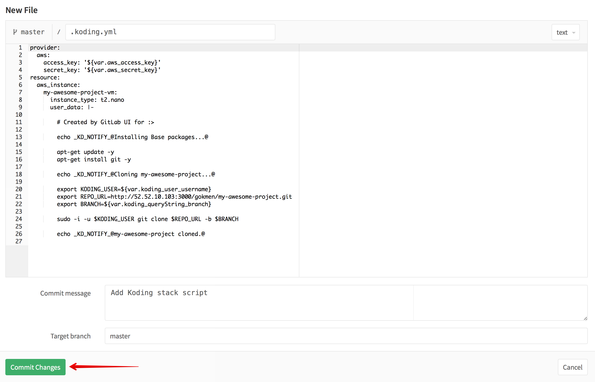

## Run a project on Koding

If there is `.koding.yml` exists in your project root, you will see
`Run in IDE (Koding)` button in your project landing page. You can initiate the
process from here.

This will open Koding defined in the settings in a new window and will start
importing the project's stack file.

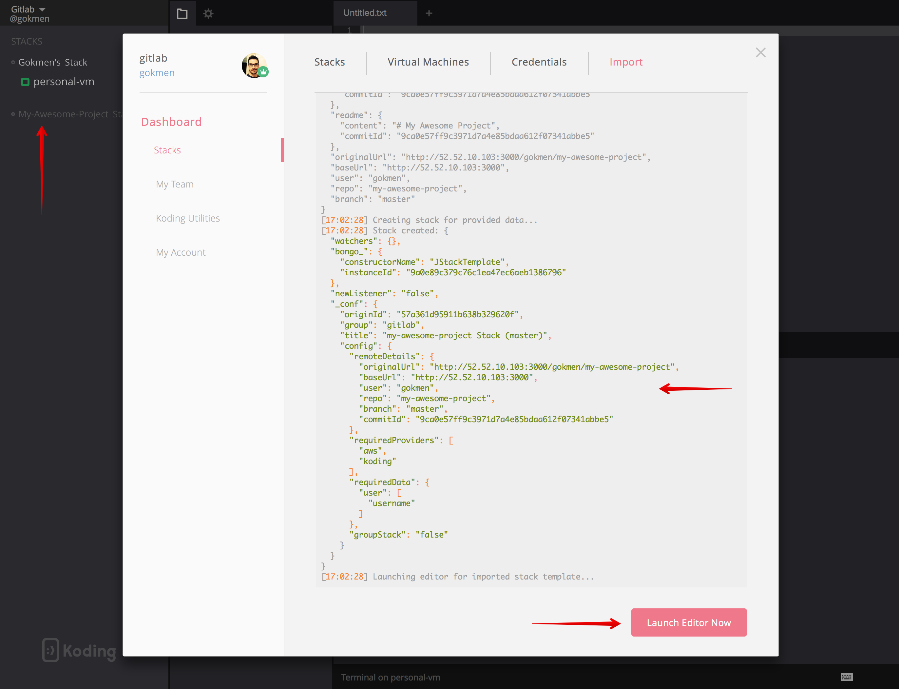

You should see the details of your repository imported into your Koding
instance. Once it's completed it will lead you to the Stack Editor and from
there you can start using your new stack integrated with your project on your
GitLab instance. For details about what's next you can follow
[this guide](https://www.koding.com/docs/creating-an-aws-stack) from step 8.

Once stack initialized you will see the `README.md` content from your project
in `Stack Build` wizard, this wizard will let you to build the stack and import
your project into it. **Once it's completed it will automatically open the
related vm instead of importing from scratch**.

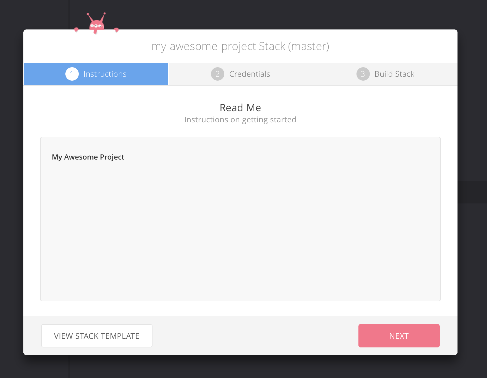

This will take time depending on the required environment.

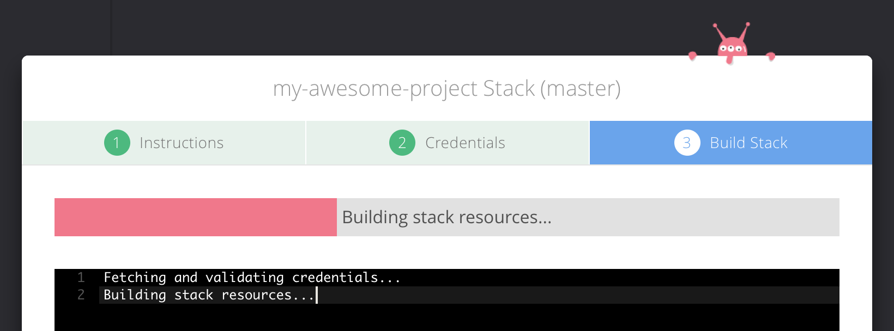

It usually takes ~4 min. to make it ready with a `t2.nano` instance on given
AWS region. (`t2.nano` is default vm type on auto-generated stack template
which can be manually changed).

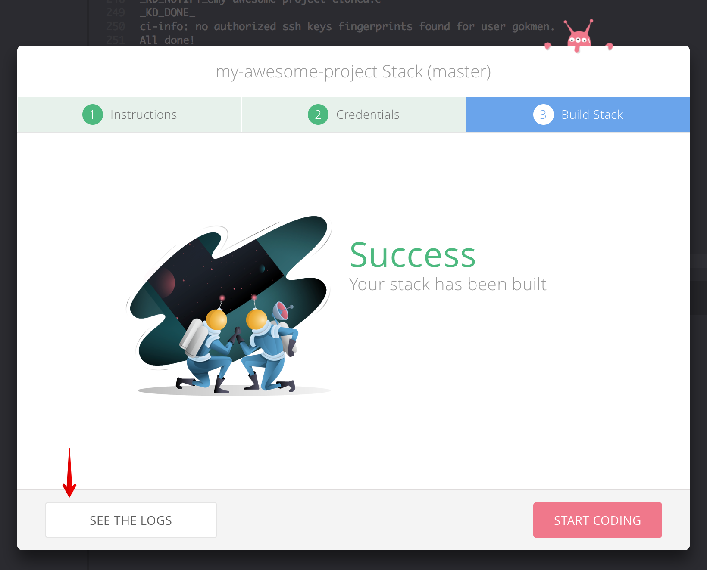

You can check out the `Build Logs` from this success modal as well.

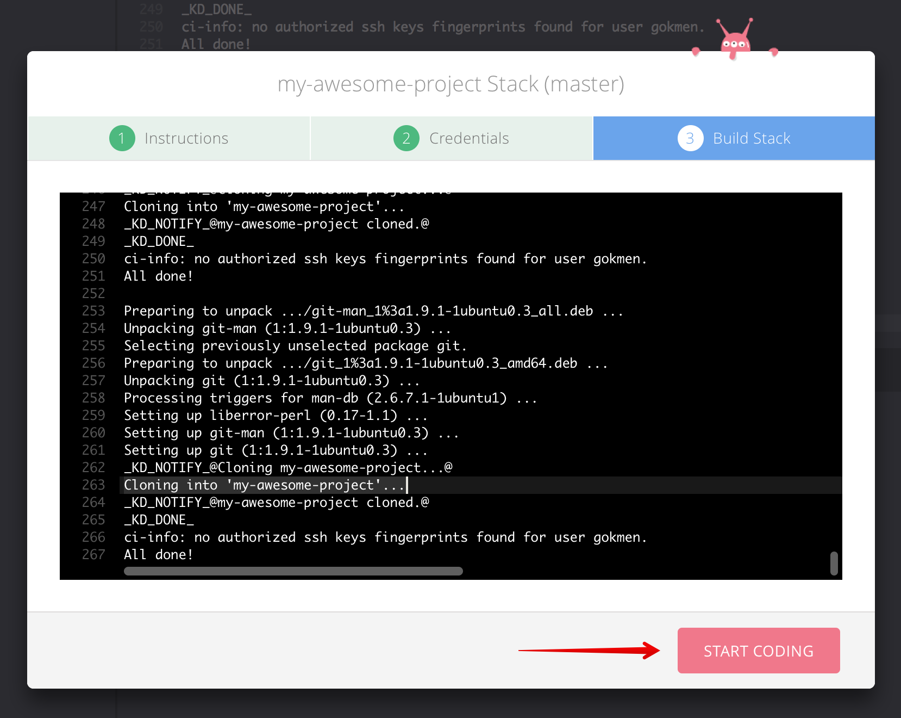

You can now `Start Coding`!

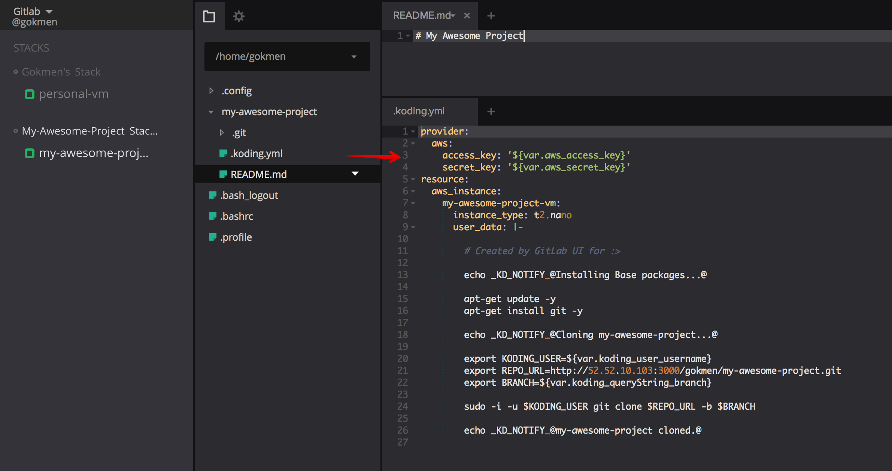

## Try a Merge Request on IDE

It's also possible to try a change on IDE before merging it. This flow only
enabled if the target project has `.koding.yml` in it's target branch. You
should see the alternative version of `Run in IDE (Koding)` button in merge
request pages as well;

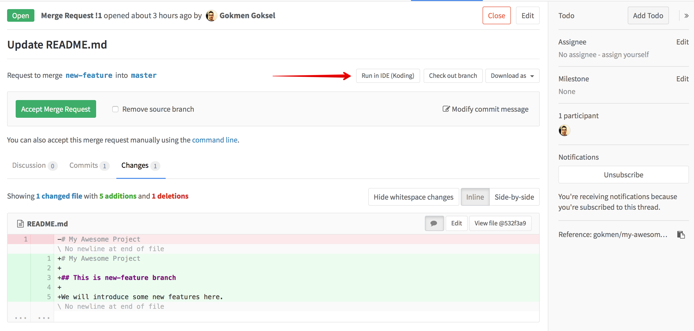

This will again take you to Koding with proper arguments passed, which will
allow Koding to modify the stack template provided by target branch. You can
see the difference;

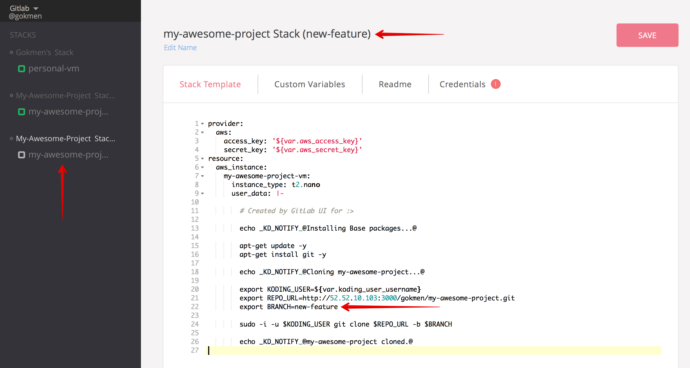

The flow for the branch stack is also same with the regular project flow.

## Open GitLab from Koding

Since stacks generated with import flow defined in previous steps, they have
information about the repository they are belonging to. By using this
information you can access to related GitLab page from stacks on your sidebar
on Koding.

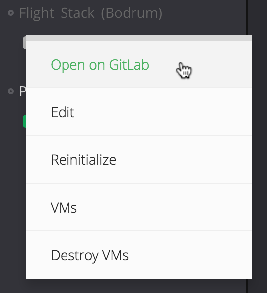

## Other links

- [YouTube video on GitLab + Koding workflow][youtube]
- [Koding documentation][koding-docs]

[ce-5909]: https://gitlab.com/gitlab-org/gitlab-ce/merge_requests/5909
[youtube]: https://youtu.be/3wei5yv_Ye8
[koding-docs]: https://www.koding.com/docs
